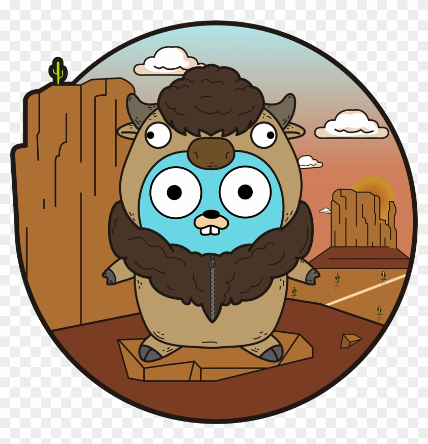

[![LinkedIn][linkedin-shield]][linkedin-url]


<!-- PROJECT LOGO -->
<br />
<p align="center">
    <a href="https://github.com/amupxm/go-video-concat">
    
  </a>

  <h3 align="center">simple Golang video concat api</h3>

  <p align="center">
    Extremely fast API for editing social media suitable contents.
    <br />
   
  </p>
</p>


<!-- GETTING STARTED -->
## Getting Started

Just start app with docker compsoe.
### Prerequisites

if you want to serve app outside of dockerd use script below :
* debian based linux : 
  ```sh
    apt-get update && apt-get install -y \
        ffmpeg \
        libmediainfo-dev \
        zlib* \
        gcc \
        go && rm -rf /var/lib/apt/lists/*
    go get . && go build -v 
  ```
* openSUSE : 
  ```sh
    zypper in -y \
        libmediainfo-devel\
        zlib-devel\
        zlib*\
        ffmpeg\
        gcc \
        go && rm -rf /var/lib/apt/lists/*
    go get . && go build -v 
  ```
### Usage

#### 1. add frame : 
A frame is an image which your video will centered inside it.
for example : 

</br>
<p align="center">

</p>

First simply upload your frame to s3 :
   ```sh
   curl --location --request POST 'localhost:8080/frame/upload' \
--form 'upload=@"cover.png"'
   ```
Which will return an unique uuid code. Then send post requst to `localhost:8080/frame` like example :

``` json
    {
        "name" : "template name" , 
        "file_code" : "8a19d34e-ce11-4730-8853-9b2ec3a21ec4",
        "height": 303,
        "width": 540,
        "start_offset": 300
    }
```
Start_offset is <i>Y</i> coordination of template.This request will return an uuid code.You can use below end-point to ger frames:

``` sh
# get list of frames :
curl --location --request GET 'localhost:8080/frame'

# get single frame information (height , offests and ...) :
curl --location --request GET 'localhost:8080/frame/:UUID'

# get frame file
curl --location --request GET 'localhost:8080/frame/:UUID/file'
```


#### 2. Create splash
A splash is a required short video (something like a logo) which shown in start of your video.You can merge any video with any voice ( or music).

``` sh 
# add base file ( video file )
curl --location --request POST 'localhost:8080/splash/base' \
--form 'upload=@"video.mp4"'

# add voice (music file)
curl --location --request POST 'localhost:8080/splash/audio' \
--form 'upload=@"video.mp3"'
```
Then merge them together :

``` json
{
    "base_file": "c7d6d339-6668-42a8-b569-da7ab101e5a6",
    "base_audio": "db20ab4d-59e1-45fb-a9c5-0df2b4603d0e",
    "name": "splash for test",
    "max_length": 7 , 
    "base_color" : "#FF6600"
}
```

In this example <i>max_length</i> is duration of your splash file. It will generate empty file parts if the <i>max_length</i> be longer than video or audio length.The <i>base_color</i> will be a background for splash if you use transparent videos or when you are using splash file in different alignment frame size.  
<br>
You can check generated splash file using `localhost:8080/splash/:code` end point.


#### 3. Concator:
Concator is a process include merge / trim and overlaying media contents on frame.Like below example :

``` json 
{
    "video_name": "video name",
    "sound_level": 70,
    "call_back_address": "https://google.com",
    "splash_file": "8fe439c1-8f15-4950-8c52-48838acedbdd",
    "frame_code": "8a19d34e-ce11-4730-8853-9b2ec3a21ec4",
    "audio_file":"http://localhost:8081/voice.mp3",
    "has_audio" : true , 
    "inputs": [
        {
            "type": "image",
            "path": "http://localhost:8081/image.png",
            "start": 0,
            "end": 2
        },
        {
            "type": "video",
            "path": "http://localhost:8081/video.mp4",
            "start": 2,
            "end": 10
        }
    ]
} 
```
This request will make a video with 17 seconds length (2'' image + 8'' video + 7'' splash [step 2]), Then overlay audio file with 70% sound level on it and place it inside of the frame. This could be a long process so it will call your call_back url , when it's done.

<br>

You can use `localhost:8080/generator/:code` to check process percentage and current status.


## Contributing

Contributions are what make the open source community such an amazing place to be learn, inspire, and create. Any contributions you make are **greatly appreciated**.

1. Fork the Project
2. Create your Feature Branch (`git checkout -b feature/AmazingFeature`)
3. Commit your Changes (`git commit -m 'Add some AmazingFeature'`)
4. Push to the Branch (`git push origin feature/AmazingFeature`)
5. Open a Pull Request


<!-- LICENSE -->
## License

Distributed under the MIT License. See `LICENSE` for more information.


<!-- CONTACT -->
## Contact

Amir Hossein Mokaramifar - [@amupxm](https://twitter.com/amupxm) - amupxm@gmail.com


[linkedin-shield]: https://img.shields.io/badge/-LinkedIn-black.svg?style=for-the-badge&logo=linkedin&colorB=555
[linkedin-url]: https://www.linkedin.com/in/mokaramifar/
[product-screenshot]: images/screenshot.png
